# 🌿 Learn With Naina

A production ready full stack **Learning Management System (LMS)** developed to support my personal tutoring platform. The application digitizes my tutoring workflow by allowing students to securely enroll in courses, access structured lessons, and study PDF materials directly within the browser, while providing a dedicated tutor dashboard to create courses, organize lessons, and upload learning resources.

The platform is **currently being used by three active students** to access course materials and lessons. Although originally built for my own tutoring practice, its modular architecture makes it easily adaptable for schools, coaching centers, or online education platforms.

---

## ✨ Highlights

- Designed and developed a full stack Learning Management System for my personal English tutoring platform.
- Currently supporting **3 active students** using the platform for accessing course materials and lesson resources.
-  Implemented secure JWT authentication with bcrypt password hashing and role based authorization.
- Built complete course enrollment and lesson management workflows for students.
- Integrated a PDF reader with zoom controls for seamless learning.
- Implemented Cloudinary based PDF storage with Multer for efficient file uploads.
- Developed separate Student and Tutor dashboards with protected routes.
- Built a RESTful backend using Express.js and MongoDB.
- Created a responsive React application with React Router and Axios.
- Deployed the application using Render, Vercel and MongoDB Atlas.

---

# 🚀 Live Demo

### Frontend

**https://learn-with-naina.vercel.app/**

### Backend API

**https://learnwithnaina.onrender.com**

---

# 📸 Application Preview

## Landing Page


---

## Login

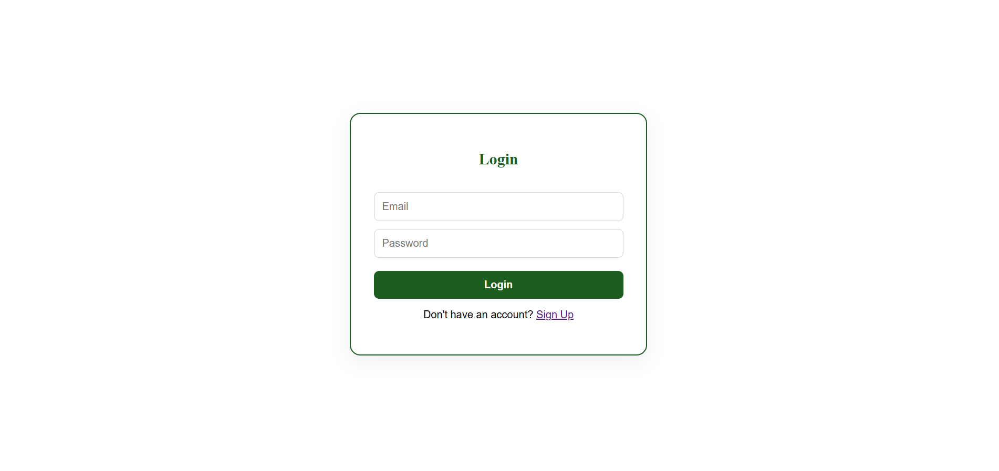

---

## Sign Up

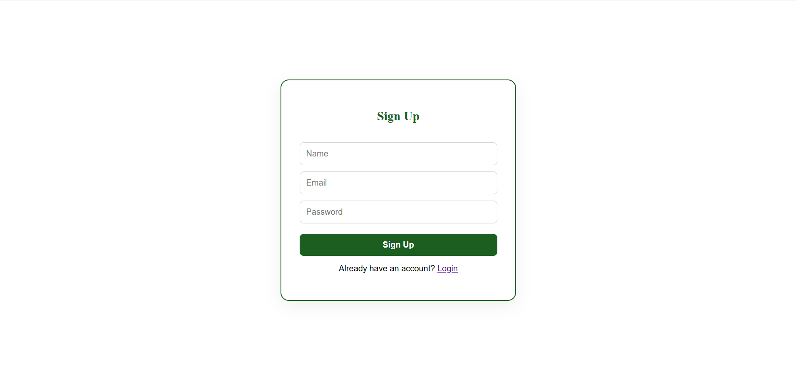

---

## Student Dashboard

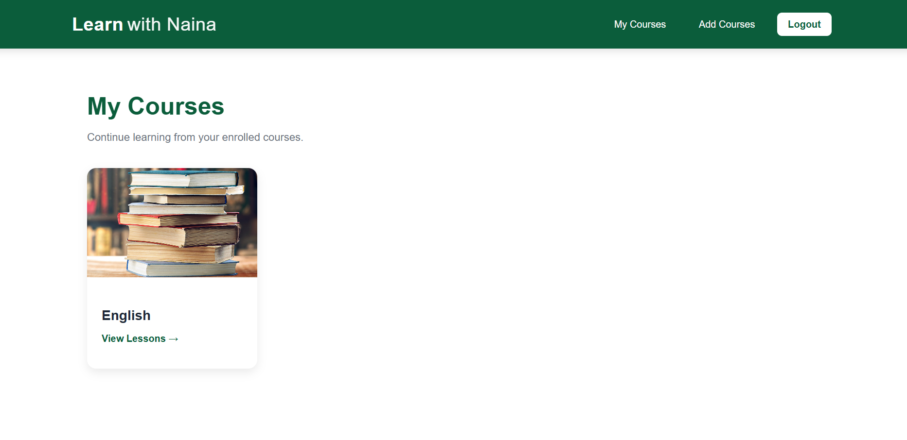

---

## Available Courses

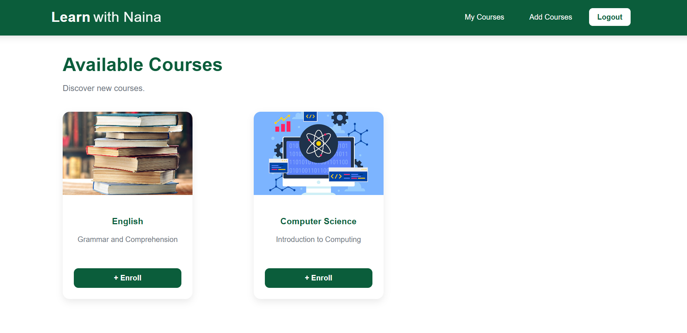

---

## Lessons

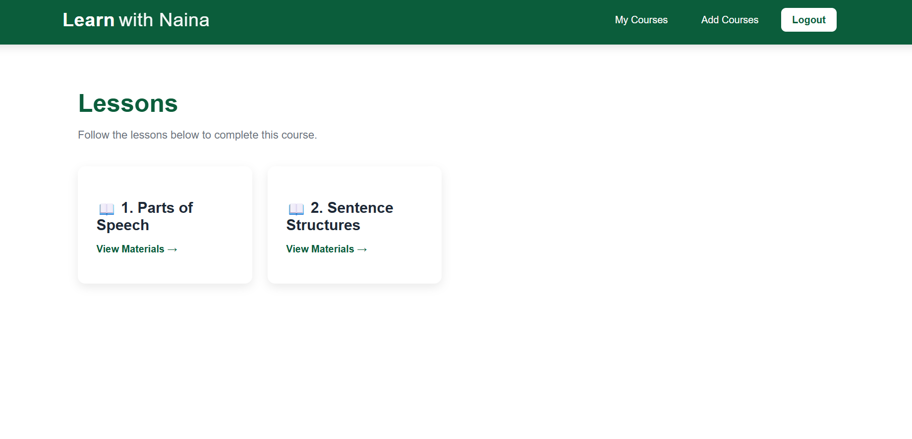

---

## Learning Materials

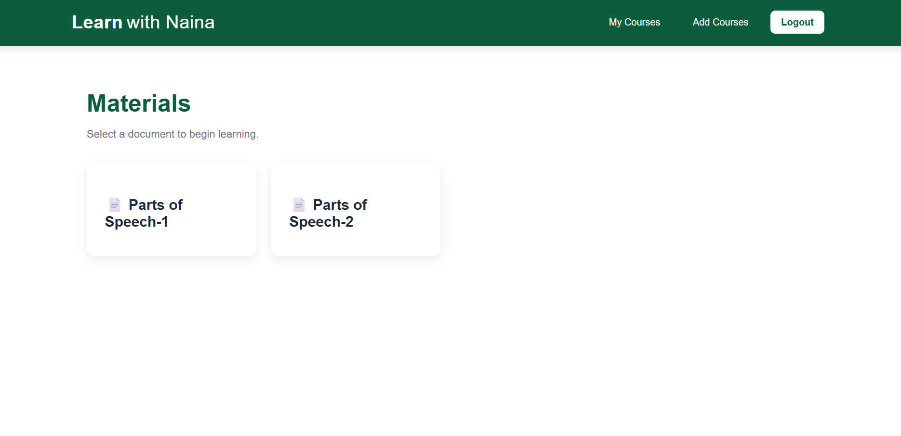

---

## PDF Viewer

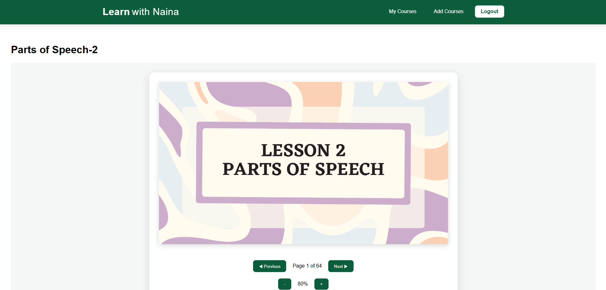

---

## Admin Dashboard

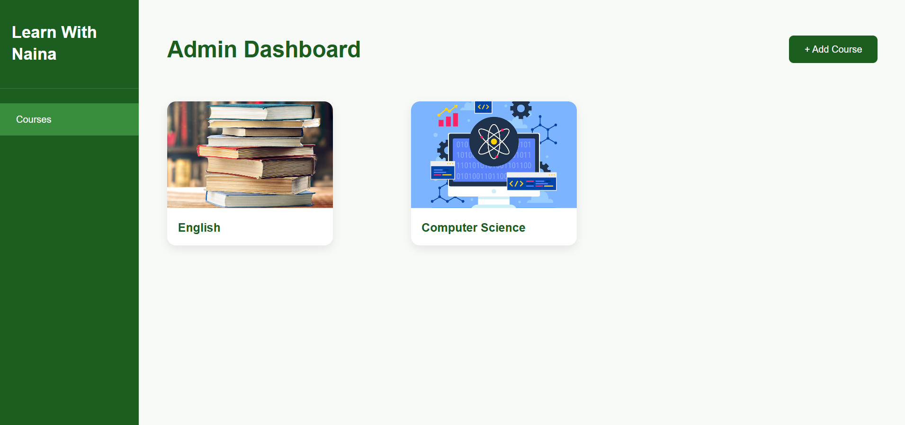

---

## Course Management

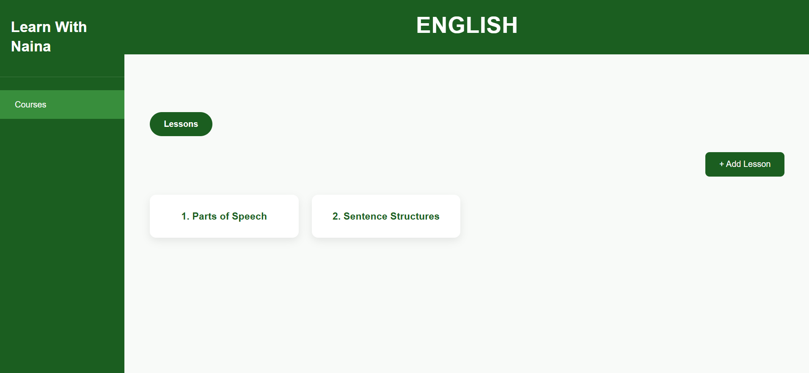

---

## Lesson Materials Management

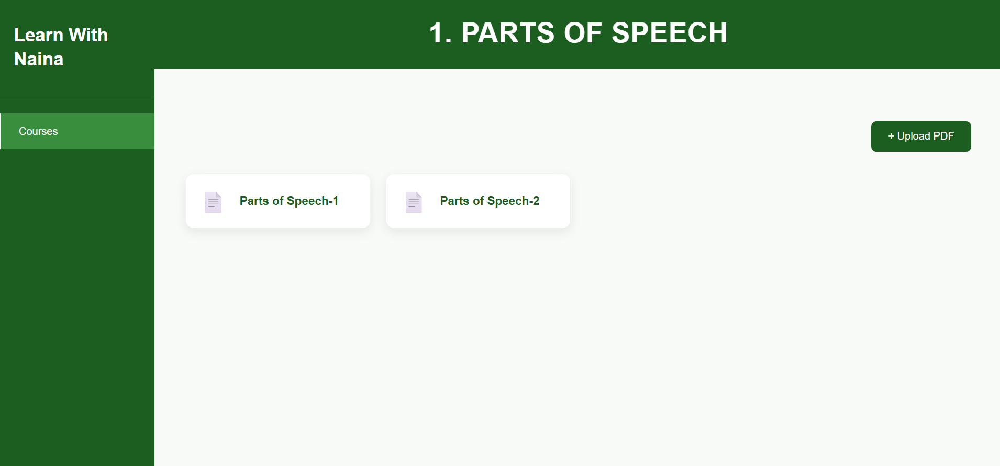

---

## Admin PDF Viewer

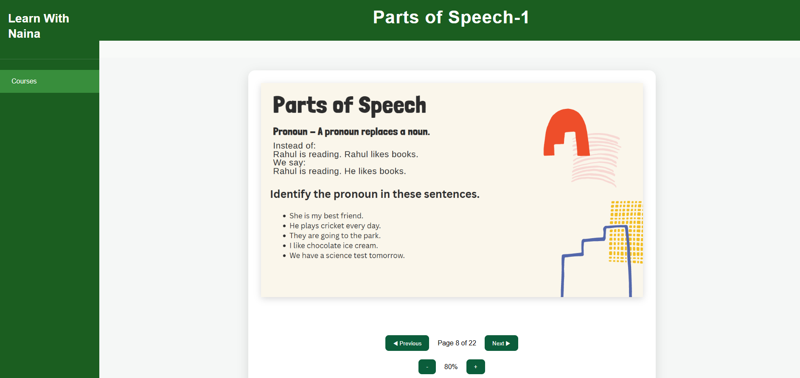

---

# ✨ Features

## Student Portal

- Secure user authentication
- Register and login
- Browse available courses
- Enroll in courses
- View enrolled courses
- Navigate lessons
- Access learning materials
- Read PDFs directly inside the application
- Responsive user interface

---

## Admin Portal

- Role based admin authentication
- Create new courses
- Add lessons to courses
- Upload PDF learning materials
- Organize educational resources
- View uploaded documents
- Manage course content through an intuitive dashboard

---

# 🏗 System Architecture

```text
                    Student / Tutor
                           │
                           ▼
                    React Frontend
                           │
                    Axios / REST API
                           │
                           ▼
                 Express.js Backend
        (JWT Authentication & Authorization)
                 │                │
                 ▼                ▼
          MongoDB Atlas      Cloudinary
```

---

# 🛠 Tech Stack

## Frontend

- React
- React Router
- Axios
- React PDF
- CSS

### Backend

- Node.js
- Express.js
- MongoDB Atlas
- Mongoose
- JWT Authentication
- bcryptjs
- Multer
- Cloudinary

### Deployment

- Render
- Vercel
- MongoDB Atlas

---

# 📂 Project Structure

```text
LearnWithNaina/
│
├── assets/                     
│
├── backend/
│   ├── config/                 
│   ├── controllers/            
│   ├── models/                 
│   ├── routes/                 
│   ├── uploads/                
│   ├── server.js               
│   └── package.json
│
├── frontend/
│   ├── public/
│   ├── src/
│   │   ├── assets/             
│   │   ├── components/          
│   │   ├── layouts/            
│   │   ├── pages/               
│   │   ├── services/            
│   │   ├── styles/             
│   │   ├── App.jsx             
│   │   └── main.jsx            
│   │
│   ├── index.html
│   ├── vite.config.js
│   └── package.json
│
└── README.md
```
---

# 🔐 Authentication

The application uses secure JWT authentication.

### Features

- User Registration
- User Login
- Password Hashing (bcrypt)
- JSON Web Tokens (JWT)
- Protected Routes
- Role Based Authorization

---


# ⚡ Core Functionalities

- User Authentication
- Course Enrollment
- Course Management
- Lesson Management
- PDF Upload
- Cloud Storage
- Embedded PDF Viewer
- Student Dashboard
- Admin Dashboard
- Protected Admin Routes


# ⚙️ Installation

## Clone Repository

```bash
git clone https://github.com/k-o-c-o/LearnWithNaina.git
```

---

## Backend

```bash
cd backend
npm install
npm run dev
```

---

## Frontend

```bash
cd frontend
npm install
npm run dev
```


# 👩‍💻 Author

**Naina Edwin**

B.Tech Computer and Communication Engineering  
Manipal Institute of Technology

GitHub: https://github.com/k-o-c-o

---

## ⭐ If you found this project interesting, consider giving it a star!